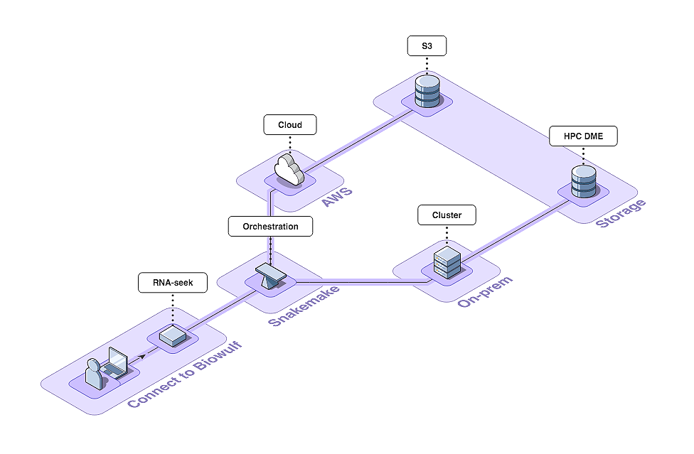
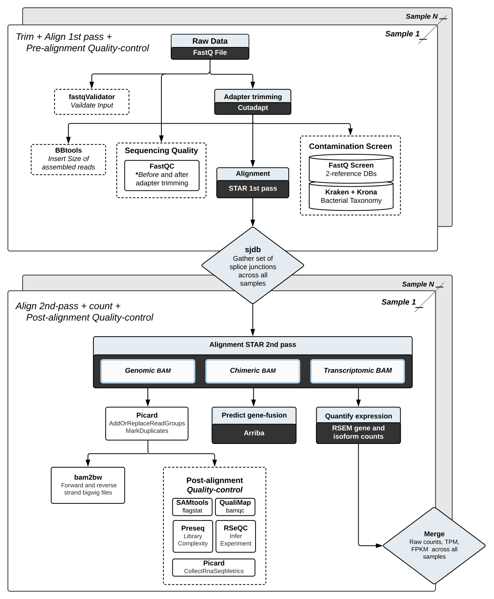

# RENEE - **R**na s**E**quencing a**N**alysis pip**E**lin**E**

An open-source, reproducible, and scalable solution for analyzing RNA-seq data.

[](https://github.com/CCBR/RENEE/actions/workflows/main.yaml)
[](https://github.com/CCBR/RENEE/actions/workflows/docs.yml)
[](https://zenodo.org/doi/10.5281/zenodo.10553198)

### Table of Contents

- [RENEE - **R**na s**E**quencing a**N**alysis pip**E**lin**E**](#renee---rna-sequencing-analysis-pipeline)
  - [Table of Contents](#table-of-contents)
  - [1. Introduction](#1-introduction)
  - [2. Overview](#2-overview)
    - [2.1 RENEE Pipeline](#21-renee-pipeline)
    - [2.2 Reference Genomes](#22-reference-genomes)
    - [2.3 Dependencies](#23-dependencies)
  - [3. Run RENEE pipeline](#3-run-renee-pipeline)
    - [3.1 Biowulf](#31-biowulf)
    - [3.2 FRCE](#32-frce)
  - [4. References](#4-references)
  - [5. Version Notes](https://github.com/CCBR/RENEE/blob/main/CHANGELOG.md)

### 1. Introduction

RNA-sequencing (_RNA-seq_) has a wide variety of applications. This popular transcriptome profiling technique can be used to quantify gene and isoform expression, detect alternative splicing events, predict gene-fusions, call variants and much more.

**RENEE** is a comprehensive, open-source RNA-seq pipeline that relies on technologies like [Docker<sup>20</sup>](https://www.docker.com/why-docker) and [Singularity<sup>21</sup>... now called Apptainer](https://apptainer.org/docs/) to maintain the highest-level of reproducibility. The pipeline consists of a series of data processing and quality-control steps orchestrated by [Snakemake<sup>19</sup>](https://snakemake.readthedocs.io/en/stable/), a flexible and scalable workflow management system, to submit jobs to a cluster or cloud provider.

  
<sup>**Fig 1. Run locally on a compute instance, on-premise using a cluster, or on the cloud using AWS.** A user can define the method or mode of execution. The pipeline can submit jobs to a cluster using a job scheduler like SLURM, or run on AWS using Tibanna (feature coming soon!). A hybrid approach ensures the pipeline is accessible to all users. As an optional step, relevelant output files and metadata can be stored in object storage using HPC DME (NIH users) or Amazon S3 for archival purposes (coming soon!).</sup>

### 2. Overview

#### 2.1 RENEE Pipeline

A bioinformatics pipeline is more than the sum of its data processing steps. A pipeline without quality-control steps provides a myopic view of the potential sources of variation within your data (i.e., biological verses technical sources of variation). RENEE pipeline is composed of a series of quality-control and data processing steps.

The accuracy of the downstream interpretations made from transcriptomic data are highly dependent on initial sample library. Unwanted sources of technical variation, which if not accounted for properly, can influence the results. RENEE's comprehensive quality-control helps ensure your results are reliable and _reproducible across experiments_. In the data processing steps, RENEE quantifies gene and isoform expression and predicts gene fusions. Please note that the detection of alternative splicing events and variant calling will be incorporated in a later release.

 <sup>**Fig 2. An Overview of RENEE Pipeline.** Gene and isoform counts are quantified and a series of QC-checks are performed to assess the quality of the data. This pipeline stops at the generation of a raw counts matrix and gene-fusion calling. To run the pipeline, a user must select their raw data, a reference genome, and output directory (i.e., the location where the pipeline performs the analysis). Quality-control information is summarized across all samples in a MultiQC report.</sup>

**Quality Control**  
[_FastQC_<sup>2</sup>](https://www.bioinformatics.babraham.ac.uk/projects/fastqc/) is used to assess the sequencing quality. FastQC is run twice, before and after adapter trimming. It generates a set of basic statistics to identify problems that can arise during sequencing or library preparation. FastQC will summarize per base and per read QC metrics such as quality scores and GC content. It will also summarize the distribution of sequence lengths and will report the presence of adapter sequences.

[_Kraken2_<sup>14</sup>](http://ccb.jhu.edu/software/kraken2/) and [_FastQ Screen_<sup>17</sup>](https://www.bioinformatics.babraham.ac.uk/projects/fastq_screen/) are used to screen for various sources of contamination. During the process of sample collection to library preparation, there is a risk for introducing wanted sources of DNA. FastQ Screen compares your sequencing data to a set of different reference genomes to determine if there is contamination. It allows a user to see if the composition of your library matches what you expect. Also, if there are high levels of microbial contamination, Kraken can provide an estimation of the taxonomic composition. Kraken can be used in conjunction with [_Krona_<sup>15</sup>](https://github.com/marbl/Krona/wiki/KronaTools) to produce interactive reports.

[_Preseq_<sup>1</sup>](http://smithlabresearch.org/software/preseq/) is used to estimate the complexity of a library for each samples. If the duplication rate is very high, the overall library complexity will be low. Low library complexity could signal an issue with library preparation where very little input RNA was over-amplified or the sample may be degraded.

[_Picard_<sup>10</sup>](https://broadinstitute.github.io/picard/) can be used to estimate the duplication rate, and it has another particularly useful sub-command called CollectRNAseqMetrics which reports the number and percentage of reads that align to various regions: such as coding, intronic, UTR, intergenic and ribosomal regions. This is particularly useful as you would expect a library constructed with ploy(A)-selection to have a high percentage of reads that map to coding regions. Picard CollectRNAseqMetrics will also report the uniformity of coverage across all genes, which is useful for determining whether a sample has a 3' bias (observed in ploy(A)-selection libraries containing degraded RNA).

[_RSeQC_<sup>9</sup>](http://rseqc.sourceforge.net/) is another particularity useful package that is tailored for RNA-seq data. It is used to calculate the inner distance between paired-end reads and calculate TIN values for a set of canonical protein-coding transcripts. A median TIN value is calucated for each sample, which analogous to a computationally derived RIN.

[MultiQC<sup>11</sup>](https://multiqc.info/) is used to aggregate the results of each tool into a single interactive report.

**Quantification**  
[_Cutadapt_<sup>3</sup>](https://cutadapt.readthedocs.io/en/stable/) is used to remove adapter sequences, perform quality trimming, and remove very short sequences that would otherwise multi-map all over the genome prior to alignment.

[_STAR_<sup>4</sup>](https://github.com/alexdobin/STAR) is used to align reads to the reference genome. The RENEE pipeline runs STAR in a two-passes where splice-junctions are collected and aggregated across all samples and provided to the second-pass of STAR. In the second pass of STAR, the splice-junctions detected in the first pass are inserted into the genome indices prior to alignment.

[_RSEM_<sup>5</sup>](https://github.com/deweylab/RSEM) is used to quantify gene and isoform expression. The expected counts from RSEM are merged across samples to create a two counts matrices for gene counts and isoform counts.

[_Arriba_<sup>22</sup>](https://arriba.readthedocs.io/en/latest/) is used to predict gene-fusion events. The pre-built human and mouse reference genomes use Arriba blacklists to reduce the false-positive rate.

#### 2.2 Reference Genomes

Pre-built reference genomes are provided on Biowulf and FRCE for a number of different annotation versions, view the list here:
<https://ccbr.github.io/RENEE/RNA-seq/Resources/#1-reference-genomes>

If you would like to use a custom reference that is not already listed above,
you can prepare it with the `renee build` command. See docs here:
<https://ccbr.github.io/RENEE/RNA-seq/build/>

#### 2.3 Dependencies

**Requires:** `singularity>=3.5` `snakemake>=6.0`

> **NOTE:**  
> <ins>Biowulf users</ins>:  
> Both, singularity and snakemake, modules are already installed and available for all Biowulf users. Please skip this step as `module load ccbrpipeliner` will preload singularity and snakemake.

[Snakemake](https://snakemake.readthedocs.io/en/stable/getting_started/installation.html) and [singularity](https://singularity.lbl.gov/all-releases) must be installed on the target system. Snakemake orchestrates the execution of each step in the pipeline. To guarantee reproducibility, each step relies on pre-built images from [DockerHub](https://hub.docker.com/orgs/nciccbr/repositories). Snakemake pulls these docker images while converting them to singularity on the fly and saves them onto the local filesystem prior to job execution, and as so, snakemake and singularity are the only two dependencies.

<hr>
<p align="center">
	<a href="#renee---rna-sequencing-analysis-pipeline">Back to Top</a>
</p>
<hr>

### 3. Run RENEE pipeline

#### 3.1 Biowulf

```bash
# RENEE is configured to use different execution backends: local or slurm
# view the help page for more information
module load ccbrpipeliner
renee run --help

# @local: uses local singularity execution method
# The local MODE will run serially on compute
# instance. This is useful for testing, debugging,
# or when a users does not have access to a high
# performance computing environment.
# Please note that you can dry-run the command below
# by providing the --dry-run flag
# Do not run this on the head node!
# Grab an interactive node
sinteractive --mem=110g --cpus-per-task=12 --gres=lscratch:200
module load ccbrpipeliner
renee run --input .tests/*.R?.fastq.gz --output /data/$USER/RNA_hg38 --genome hg38_30 --mode local

# @slurm: uses slurm and singularity execution method
# The slurm MODE will submit jobs to the cluster.
# The --sif-cache flag will re-use singularity containers from a shared location.
# It is recommended running RENEE in this mode.
module load ccbrpipeliner
renee run \
  --input .tests/*.R?.fastq.gz \
  --output /data/$USER/RNA_hg38 \
  --genome hg38_30 \
  --mode slurm \
  --sif-cache /data/CCBR_Pipeliner/SIFS
```

#### 3.2 FRCE

```bash
# grab an interactive node
srun --export all --pty --x11 bash

# add renee to path correctly
. /mnt/projects/CCBR-Pipelines/pipelines/guis/latest/bin/setup

# run renee
renee --help
```

When running renee on FRCE, we recommend setting `--tmp-dir` and `--sif-cache`
with the following values:

```sh
renee run \
  --input .tests/*.R?.fastq.gz \
  --output /scratch/cluster_scratch/$USER/RNA_hg38 \
  --genome hg38_30 \
  --mode slurm \
  --tmp-dir /scratch/cluster_scratch/$USER \
  --sif-cache /mnt/projects/CCBR-Pipelines/SIFs
```

<hr>
<p align="center">
	<a href="#renee---rna-sequencing-analysis-pipeline">Back to Top</a>
</p>
<hr>

### 4. References

<sup>**1.** Daley, T. and A.D. Smith, Predicting the molecular complexity of sequencing libraries. Nat Methods, 2013. 10(4): p. 325-7.</sup>  
<sup>**2.** Andrews, S. (2010). FastQC: a quality control tool for high throughput sequence data.</sup>  
<sup>**3.** Martin, M. (2011). "Cutadapt removes adapter sequences from high-throughput sequencing reads." EMBnet 17(1): 10-12.</sup>  
<sup>**4.** Dobin, A., et al., STAR: ultrafast universal RNA-seq aligner. Bioinformatics, 2013. 29(1): p. 15-21.</sup>  
<sup>**5.** Li, B. and C.N. Dewey, RSEM: accurate transcript quantification from RNA-Seq data with or without a reference genome. BMC Bioinformatics, 2011. 12: p. 323.</sup>  
<sup>**6.** Harrow, J., et al., GENCODE: the reference human genome annotation for The ENCODE Project. Genome Res, 2012. 22(9): p. 1760-74.</sup>  
<sup>**7.** Law, C.W., et al., voom: Precision weights unlock linear model analysis tools for RNA-seq read counts. Genome Biol, 2014. 15(2): p. R29.</sup>  
<sup>**8.** Smyth, G.K., Linear models and empirical bayes methods for assessing differential expression in microarray experiments. Stat Appl Genet Mol Biol, 2004. 3: p. Article3.</sup>  
<sup>**9.** Wang, L., et al. (2012). "RSeQC: quality control of RNA-seq experiments." Bioinformatics 28(16): 2184-2185.</sup>  
<sup>**10.** The Picard toolkit. https://broadinstitute.github.io/picard/.</sup>  
<sup>**11.** Ewels, P., et al. (2016). "MultiQC: summarize analysis results for multiple tools and samples in a single report." Bioinformatics 32(19): 3047-3048.</sup>  
<sup>**12.** R Core Team (2018). R: A Language and Environment for Statistical Computing. Vienna, Austria, R Foundation for Statistical Computing.</sup>  
<sup>**13.** Li, H., et al. (2009). "The Sequence Alignment/Map format and SAMtools." Bioinformatics 25(16): 2078-2079.</sup>  
<sup>**14.** Wood, D. E. and S. L. Salzberg (2014). "Kraken: ultrafast metagenomic sequence classification using exact alignments." Genome Biol 15(3): R46.</sup>  
<sup>**15.** Ondov, B. D., et al. (2011). "Interactive metagenomic visualization in a Web browser." BMC Bioinformatics 12(1): 385.</sup>  
<sup>**16.** Okonechnikov, K., et al. (2015). "Qualimap 2: advanced multi-sample quality control for high-throughput sequencing data." Bioinformatics 32(2): 292-294.</sup>  
<sup>**17.** Wingett, S. and S. Andrews (2018). "FastQ Screen: A tool for multi-genome mapping and quality control." F1000Research 7(2): 1338.</sup>  
<sup>**18.** Robinson, M. D., et al. (2009). "edgeR: a Bioconductor package for differential expression analysis of digital gene expression data." Bioinformatics 26(1): 139-140.</sup>  
<sup>**19.** Koster, J. and S. Rahmann (2018). "Snakemake-a scalable bioinformatics workflow engine." Bioinformatics 34(20): 3600.</sup>  
<sup>**20.** Merkel, D. (2014). Docker: lightweight linux containers for consistent development and deployment. Linux Journal, 2014(239), 2.</sup>  
<sup>**21.** Kurtzer GM, Sochat V, Bauer MW (2017). Singularity: Scientific containers for mobility of compute. PLoS ONE 12(5): e0177459.</sup>  
<sup>**22.** Haas, B. J., et al. (2019). "Accuracy assessment of fusion transcript detection via read-mapping and de novo fusion transcript assembly-based methods." Genome Biology 20(1): 213.</sup>

<hr>
<p align="center">
	<a href="#renee---rna-sequencing-analysis-pipeline">Back to Top</a>
</p>
<hr>
