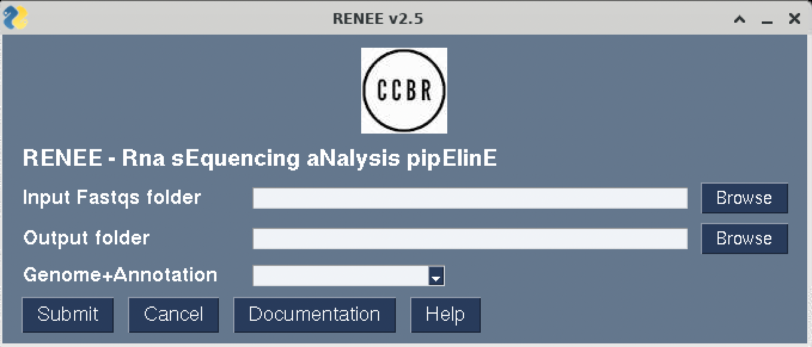
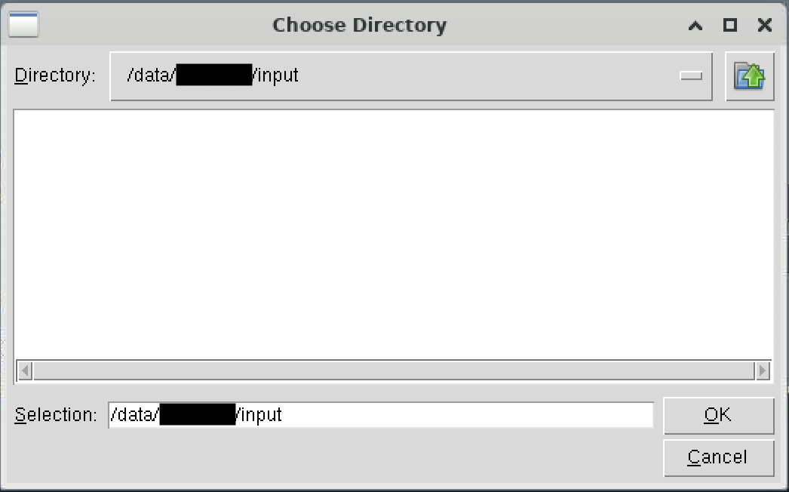
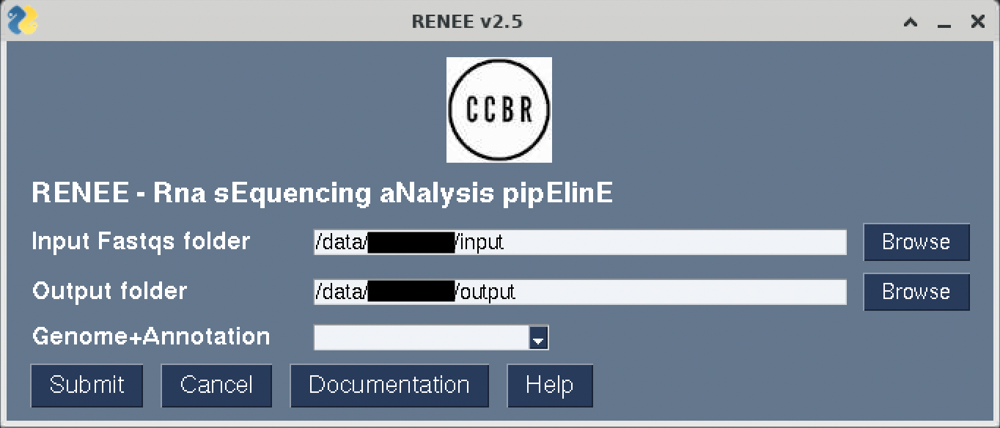
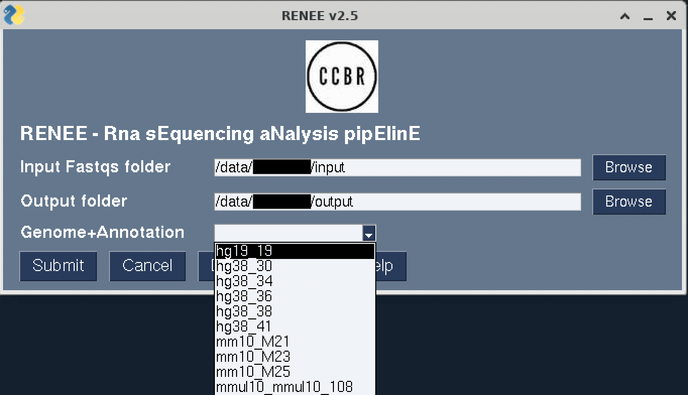
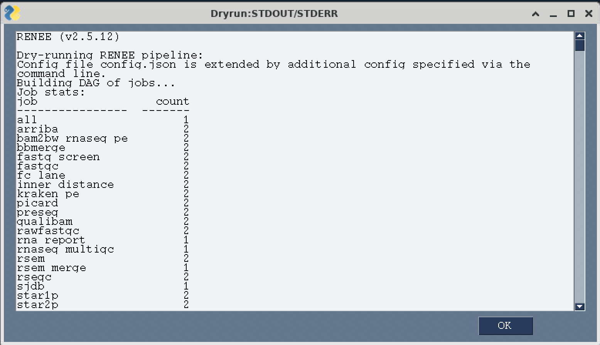
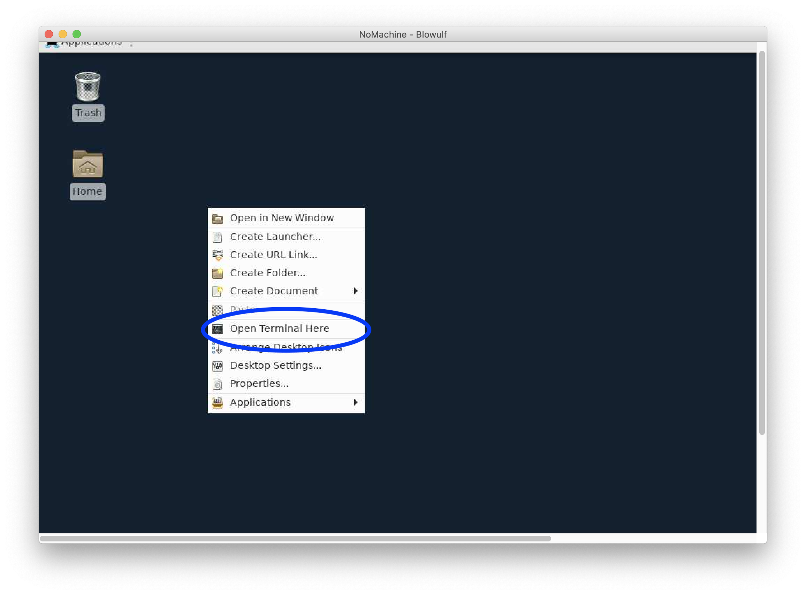
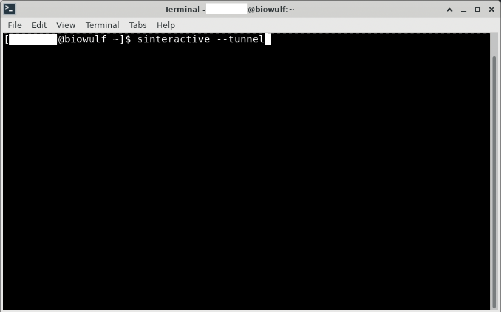
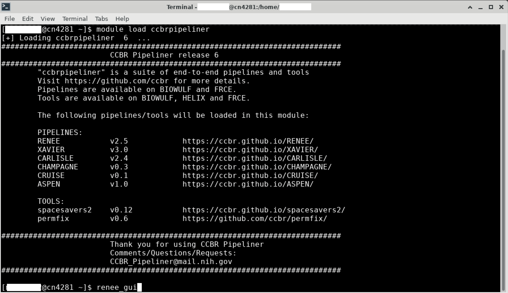

# Getting started

## 1. Synopsis

RENEE pipeline can be executed from either using the command line interface (CLI) or graphical user interface (GUI). GUI offers a more interactive way for the user to provide input and adjust parameter settings. This part of the documentation describes how to run renee using the GUI (with screenshots). See [Command Line](run.md) tab to read more about the `renee` executable and running RENEE pipeline using the CLI.

## 2. Setting up RENEE

### 2.1 Login to cluster

```bash
# Setup Step 1.) ssh into cluster's head node
# example below for Biowulf cluster
ssh -Y $USER@biowulf.nih.gov
```

### 2.2 Grab an interactive node

> **NOTE**: Make sure to add `--tunnel` flag to the sinteractive command for correct display settings. See details here: https://hpc.nih.gov/docs/tunneling/ 

```bash
# Setup Step 2.) Please do not run RENEE on the head node!
# Grab an interactive node first
sinteractive --tunnel  --time=12:00:00 --mem=8gb  --cpus-per-task=4
```

### 2.3 Load `ccbrpipeliner` module

_NOTE: `ccbrpipeliner` is a custom module created on biowulf which contains various NGS data analysis pipelines developed, tested, and benchmarked by experts at CCBR._

```bash
# Setup Step 3.) Add ccbrpipeliner module
module purge # to reset the module environment
module load ccbrpipeliner
```

If the module was loaded correctly, the greetings message should be displayed.

```bash
[+] Loading ccbrpipeliner  6  ... 
###########################################################################
			CCBR Pipeliner release 6
###########################################################################
	"ccbrpipeliner" is a suite of end-to-end pipelines and tools
	Visit https://github.com/ccbr for more details.
	Pipelines are available on BIOWULF and FRCE.
	Tools are available on BIOWULF, HELIX and FRCE.

	The following pipelines/tools will be loaded in this module:
	 
	PIPELINES:
	RENEE		v2.5		https://ccbr.github.io/RENEE/
	XAVIER		v3.0		https://ccbr.github.io/XAVIER/
	CARLISLE	v2.4		https://ccbr.github.io/CARLISLE/
	CHAMPAGNE	v0.3		https://ccbr.github.io/CHAMPAGNE/
	CRUISE		v0.1		https://ccbr.github.io/CRUISE/
	ASPEN		v1.0		https://ccbr.github.io/ASPEN/
	 
	TOOLS:
	spacesavers2	v0.12		https://ccbr.github.io/spacesavers2/
	permfix		v0.6		https://github.com/ccbr/permfix/
	
###########################################################################
			Thank you for using CCBR Pipeliner
			Comments/Questions/Requests:
			CCBR_Pipeliner@mail.nih.gov
###########################################################################
```

To check the current version of RENEE, enter:

```bash
renee --version
```

## 3. Running RENEE

### 3.1 Launching RENEE GUI

To run the RENEE pipeline from the GUI, simply enter:

```bash
renee gui
```

and it will launch the RENEE window.

> Note: Please wait until `window created!` message appears on the terminal.



### 3.2 Folder paths and reference genomes

To enter the location of the input folder containing FASTQ files and the location where the results should be created, either simply type the absolute paths

or use the **Browse** tab to choose the input and output directories







Next, from the drop down menu select the reference genome (hg38/mm10)




### 3.3 Submit RENEE job

After all the information is filled out, press **Submit**.

If the pipeline detects no errors and the run was submitted, a new window appears that has the output of a "dry-run" which summarizes each step of the pipeline.



Click **OK**

A dialogue box will popup to confirm submitting the job to slurm.

Click **Yes**

An email notification will be sent out when the pipeline starts and ends.


## 4. Special instructions regarding X11 Window System

RENEE GUI natively uses the X11 Window System to run RENEE pipeline and display the graphics on a personal desktop or laptop. The X11 Window System can be used to run a program on Biowulf and display the graphics on a desktop or laptop. However, X11 can be unreliable and fail with many graphics applications used on Biowulf. The HPC staff recommends NoMachine (NX) for users who need to run graphics applications.

Please see details [here](https://hpc.nih.gov/docs/nx.html) on how to install and connect to Biowulf on your local computer using NoMachine.

Once connected to Biowulf using NX, right click to open a terminal connection



and start an interactive session (with `--tunnel` flag).



Similar to the instructions above, load the `ccbrpipeliner` module and enter `renee gui` to launch the RENEE gui.

